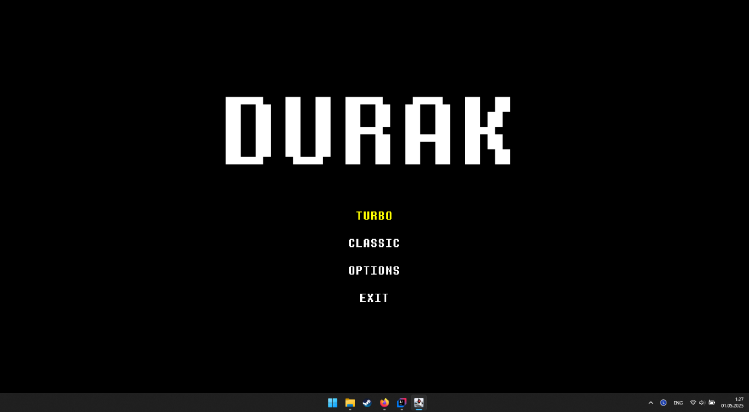
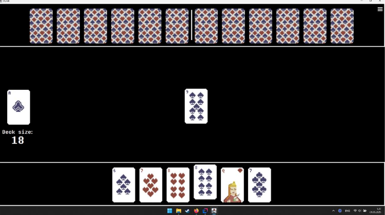
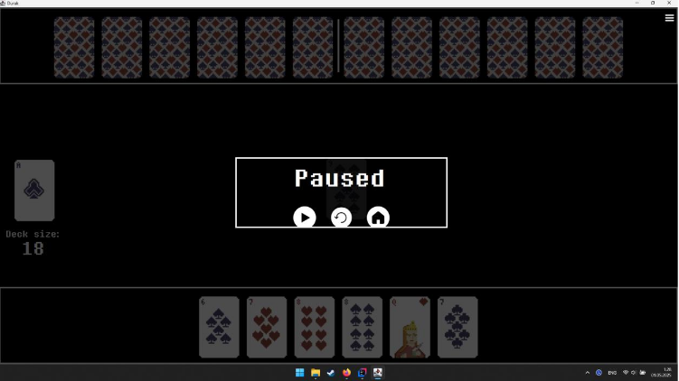

# 🃏 Durak (Card Game)

A desktop implementation of the classic Russian card game **Durak**, built in **Java (Swing)** with full game logic, multiple modes, and a pixel-art inspired interface.  

---

## 🎮 Game Features
- Two modes:
  - **Classic** (52 cards)
  - **Turbo** (36 cards)
- Play against **two computer opponents (bots)**
- **Trump suit system** — one suit beats others
- **Interactive gameplay** — click cards to play/defend
- **Responsive UI** with player hand, opponents, and deck status
- **Pause menu** with Resume / Restart / Exit
- **Game over screen** with option to restart or exit
- **Pixel-style cards and font**
- **Sound effects and background music**

---

## 🛠️ Tech Stack
- **Java** (Swing, OOP principles)
- **JFrame & JPanel** for UI
- **Custom graphics & pixel fonts**
- **SoundService** for audio playback

---

## ⚙️ Installation & Run

### 1. Clone the repository
```bash
git clone https://github.com/Zhalgas03/The-Durak.git
cd DurakGame
```

### 2. Compile & Run
```bash
javac -d bin src/**/*.java
java -cp bin Main
```

### 🎮 Game Controls
- **Click cards** to play or defend  
- **Pause menu** → Resume / Restart / Exit to Menu  
- **Win condition** → First player to empty their hand wins  

---

## 📸 Screenshots

### Main Menu  
Choose **Classic (52 cards)** or **Turbo (36 cards)** mode.  


### Gameplay  
Interactive board with player hand, opponents, deck counter, and trump suit.  


### Pause Menu  
Pause overlay with resume, restart, or exit options.  



---

## 📈 Future Improvements
- 🤖 Smarter bot AI with adaptive strategies  
- 🌐 Multiplayer mode (local or online)  
- 🎴 Animation effects for card movements  
- 📊 Extended statistics (wins/losses, average rounds, etc.)  

---

## 📌 Repository
👉 [GitHub: Zhalgas03/DurakGame](https://github.com/Zhalgas03/The-Durak)

